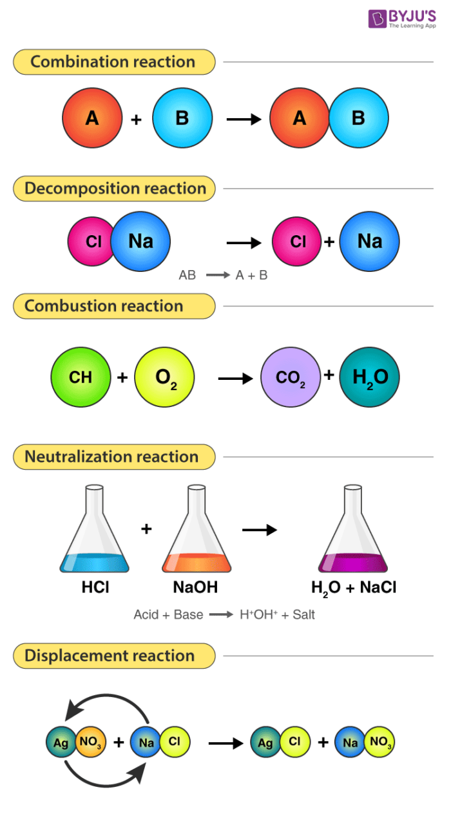

#science
# Physical & Chemical Changes

### **************************************Chemical Properties**************************************

Chemical properties is the “potential” for it to undergo some chemical change reaction by virtue of its composition

E.g.

- H2 has the ability ignite and explode, given the right conditions = chemical property
- Most metals react to acids. E.g. Zinc + HCl → Hydrogen gas

Some examples of chemical properties

- Burn
- Tarnish
- Rust
- Decompose
- React with other metals
- Instability
- Do acid/base reactions

Examples of Chemical Changes:

- Burning
- Rusting
- Tarnishing
- Decomposing
- Polymerization
    - A chain that repeats itself and bonds as a chain.
    - Paint/plastic is an example of a polymer

In a chemical change:

- Reacting substances form new substances with different compositions and properties
- A chemical reaction takes place
- Old bonds are broken and new bonds are made between atoms. Atoms in the reactants are rearranged to form new substances
- Produces 1+ new substances

Evidence of chemical changes

- Colour change
- Odour change
- Formation of precipitate
- Gas is formed (bubbles)
- Production of light
- Production of removal/gain of heat

---

### Types of Chemical Reactions

1. Synthesis reaction
2. Decomposition reaction
3. Single displacement reaction
4. Double displacement reaction
5. Combustion reaction
6. Acid-base reaction/neutralisation

Physical Change

- Does not change the substance in a chemical way, but changes the substance overall. E.g. dissolving something in water, crushing a can, breaking glass etc.
- Change in shape, size, phase

Synthesis reactions (combination) occurs when ************************************multiple reactants************************************ combine to form a ****************************single product****************************

Rusting is a synthesis reactions. Iron + water → rust

- General equation (A + B → AB)
- Can have 2+ reactants, but only one product

Decomposition reaction

- one reactant that splits into 2+ products
- When a compound breaks down into smaller parts
- AB → A + B

Combustion reactions

- Refers to the process where substance burns in presence of oxygen, giving off heat and light in the process
- Oxygen is always required to combust a substance
- Hydrocarbon combustion
- CxHy + O2 → CO2 + H2O

Single displacement reaction

- Form of substitution reaction
- If a compound has 2 parts, a single displacement reaction is when one of those parts is swapped for a new part
- A more reactive element moves a less reactive element in a compound
- Use reactivity trends
- Form
    - A + BC → B + AC (where A is the metal)
    - A + BC → C + BA (where A is the non-metal)

Precipitation Reactions (Double displacement reactions) are another substitution reaction. Here, a two-part compound reacts with another two-part compound. Both compounds break apart, then rearrange in a different order.

- Precipitation: two solutions from ionic compounds. Formation of a solid from two solutions
- Formula for double displacement: AB + CD → CB + AD

Ionic compound = metal + non-metal

---

****************************Acid Baes Reactions (neutralisation)**************************** The pH is a measure of how many hydrogen ions are in a solution. The lower the pH is, more hydrogen ions are there. The pH is logarithmic, e.g. pH4 is ten times more acidic than pH 5

- Acid: pH < 7
- Base: pH > 7
- Neutralisation reactions are reactions in which acids and bases react together to form salt and water
- A type of double displacement reactions
- EQ:
    - Acid + base → salt + water
    - HX + MOH → MX + H2O (where X and M are elements)
- Examples
    - Sulfuric acid is used to neutralise calcium hydroxide

### Precipitation Reactions

>[!notes] Steps
>
>1. Write out the equation, and balance it
>2. Split all (aq) substances into their ions as they split
>3. Cancel out all (aq) substances of both side if they are the same
>4. You end up with the net reaction

